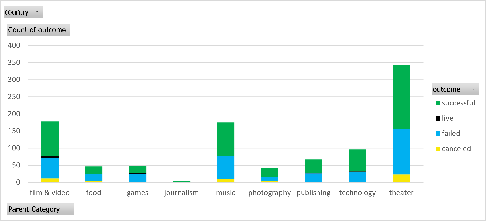
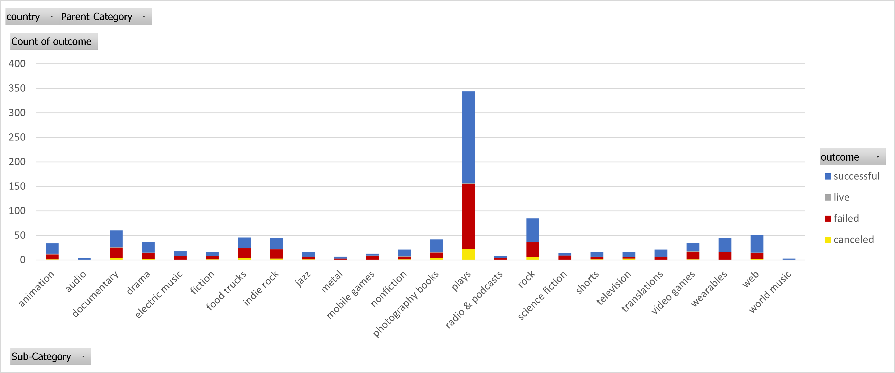
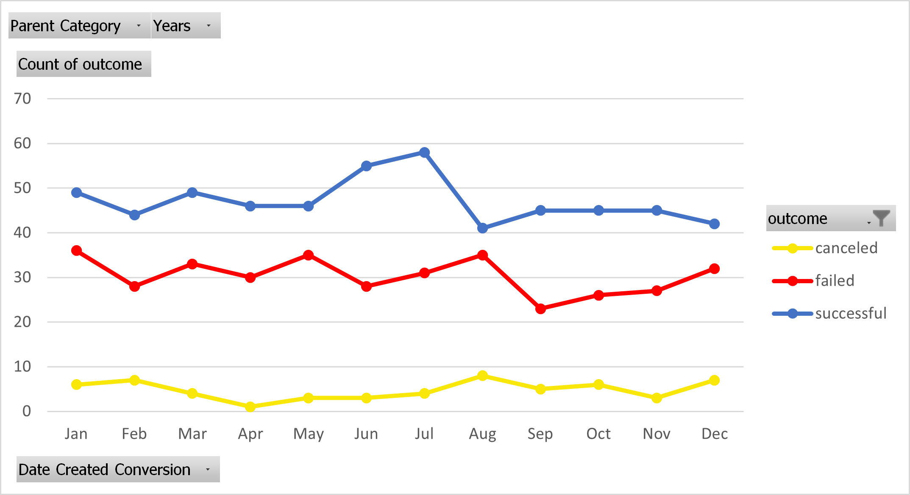
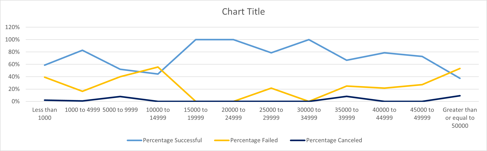

# excel-challenge

Module 1 Assignment
1.	Given the provided data, what are three conclusions that we can draw about crowdfunding campaigns?

Various conclusions can be drawn from the data and the graphs I’ve created from it. One being the ‘Theater’ category has the most campaigns across all categories. This allows for us to see a good spread of successful, failed and canceled campaigns. Another conclusion that can be drawn from the data is that journalism is the least supported across all the categories, with only 4 campaigns in total. Lastly, another estimation we can assume from the data is throughout the Parent Categories, campaigns are often more successful than they are deemed a failure.

2.	What are some limitations of this dataset?

Some of the limitations that can be seen in this data set is that the donation currency is not the same amongst all of the campaigns. So while some campaign successes are being valued at an USD rate, there are multiple countries being compared here. The campaigns also were set to last for different amounts of time. So in some cases a campaign only lasted 4 days while other ones lasted months.

3.	What are some other possible tables and/or graphs that we could create, and what additional value would they provide?
We could look at the given data we have and review the relationship between the amount of backers versus the outcome of the campaign. That way we could assess any significant trends between the amount of backers and whether or not the campaign was successful. Another set of data we could look into is which sub-categories are the highest performing under their specific category. With this information, you would have a broader view of which campaigns are the most successful so you know which ones to back.

Bonus Exercise #2 Questions:
1.	Use your data to determine whether the mean or the median better summarizes the data.

In this case, I would recommend using the mean to best summarize the data. Since this is a large data set, with no clear outliers, the mean will give you a better idea of the data at hand.

2.	Use your data to determine if there is more variability with successful or unsuccessful campaigns. Does this make sense? Why or why not?

There is more variability with the successful campaigns. This would make sense because there were over 1,000 more successful campaigns than failed, leaving more room for various amount of backers.

